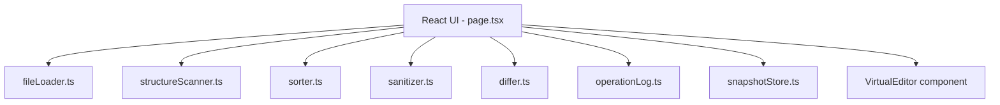

# Design Document: JSON Editor Overhaul

## Overview

The overhaul replaces the existing fragile, auth-gated JSON editor with a clean, local-only Next.js application. The architecture is built around pure-function modules for each core operation (sort, scan, sanitize), a simple React state machine for the UI, and an append-only operation log. Correctness is enforced by mandatory element-count verification on every sort. Speed is never traded for accuracy.

---

## Architecture



All modules are pure functions or simple class instances with no cross-module imports. The UI is the only orchestrator. There are no circular dependencies.

---

## Components and Interfaces

### `fileLoader.ts`

```ts
interface LoadResult {
  data: JsonValue;
  filename: string;
  sizeBytes: number;
  error?: string;
}

function parseJsonFile(text: string): LoadResult
```

### `structureScanner.ts`

```ts
interface ContainerInfo {
  path: string;           // dot-notation path, e.g. "employees"
  elementCount: number;
  availableKeys: string[];
}

interface ScanResult {
  containers: ContainerInfo[];
  durationMs: number;
}

function scanStructure(data: JsonValue): ScanResult
```

### `sorter.ts`

```ts
interface SortParams {
  containerPath: string;
  sortKey: string;
  direction: "asc" | "desc";
}

interface MovementEntry {
  oldIndex: number;       // element's position before sort
  newIndex: number;       // element's position after sort
  fromLine: number;       // line number in pre-sort JSON text
  toLine: number;         // line number in post-sort JSON text
  keyValue: string;       // value of the sort key for this element
}

interface SortReport {
  containerPath: string;
  sortKey: string;
  direction: "asc" | "desc";
  countBefore: number;
  countAfter: number;
  integrityPassed: boolean;
  movementLog: MovementEntry[];   // one entry per element, always
  durationMs: number;
  error?: string;
}

interface SortResult {
  data: JsonValue;       // new root with sorted container
  report: SortReport;
}

// Pure function — no side effects
function sortContainer(data: JsonValue, params: SortParams): SortResult
```

The sort function:
1. Serializes the pre-sort data to compute `fromLine` for each element (line number of the element's opening `{` in the formatted JSON string)
2. Resolves the container at `containerPath`
3. Records `countBefore`
4. Performs a stable sort (numeric comparison for numbers, `localeCompare` for strings)
5. Records `countAfter`
6. Serializes the post-sort data to compute `toLine` for each element
7. Builds the `movementLog` — one `MovementEntry` per element
8. Verifies that the set of `oldIndex` values is a complete bijection with the set of `newIndex` values (no duplicates, no gaps)
9. If `countBefore !== countAfter` OR the bijection check fails, returns the original data with `integrityPassed: false`
10. Otherwise returns the new data with `integrityPassed: true`

### `sanitizer.ts`

```ts
interface SanitizeResult {
  data: JsonValue;
  modifiedCount: number;
}

// Pure function — no side effects
function sanitizeUnixSafe(data: JsonValue): SanitizeResult
```

Sanitization rules applied to every string value (recursively):
- Escape unescaped `"` → `\"`
- Escape unescaped `\` → `\\`
- Replace bare `\n` / `\r` with `\\n` / `\\r`
- Remove null bytes and control characters U+0000–U+001F (except `\t`, `\n`, `\r`)

### `differ.ts`

```ts
interface DiffSummary {
  added: number;
  removed: number;
  modified: number;
}

function summarizeDiff(source: JsonValue, edited: JsonValue): DiffSummary
function lineDiff(sourceText: string, editedText: string): LineDiffEntry[]
```

### `operationLog.ts`

```ts
interface LogEntry {
  timestamp: string;   // ISO 8601
  operation: string;   // "load" | "scan" | "sort" | "edit" | "sanitize" | "undo" | "snapshot-save" | "snapshot-restore" | "save"
  path?: string;
  params?: Record<string, unknown>;
  status: "ok" | "error";
  detail?: string;
}

class OperationLog {
  append(entry: LogEntry): void
  getAll(): LogEntry[]
  exportText(): string
}
```

### `snapshotStore.ts`

```ts
interface Snapshot {
  id: string;
  name: string;
  timestamp: string;
  data: JsonValue;
}

class SnapshotStore {
  save(name: string, data: JsonValue): Snapshot
  restore(id: string): Snapshot | undefined
  list(): Snapshot[]   // most recent first
}
```

---

## Data Models

### Application State (React)

```ts
interface AppState {
  sourceData: JsonValue | null;
  workingData: JsonValue | null;
  filename: string;
  undoStack: JsonValue[];          // max 10 entries
  scanResult: ScanResult | null;
  lastSortReport: SortReport | null;   // includes movementLog
  log: OperationLog;
  snapshots: SnapshotStore;
  isBusy: boolean;
  busyMessage: string;
}
```

The undo stack holds plain `JsonValue` snapshots (deep copies). Max depth is 10.

---

## Correctness Properties

*A property is a characteristic or behavior that should hold true across all valid executions of a system — essentially, a formal statement about what the system should do. Properties serve as the bridge between human-readable specifications and machine-verifiable correctness guarantees.*

### Property 1: Sort count invariant

*For any* JSON value and any valid sort parameters, the element count of the target container in the result must equal the element count before the sort.

**Validates: Requirements 4.3, 4.4**

### Property 2: Sort integrity gate

*For any* sort result where `countBefore !== countAfter`, the returned `data` must be reference-equal to the input `data` (no mutation), and `integrityPassed` must be `false`.

**Validates: Requirements 4.4**

### Property 3: Sort key ordering

*For any* sorted container with direction "asc", for every adjacent pair of elements `[a, b]`, the sort key value of `a` must be ≤ the sort key value of `b` under the comparison function used.

**Validates: Requirements 4.7, 4.8, 4.9**

### Property 4: Sort stability

*For any* sorted container, elements with identical sort key values must appear in the same relative order as in the input.

**Validates: Requirements 4.10**

### Property 11: Movement log completeness

*For any* successful sort of a container with N elements, the Movement Log must contain exactly N entries, the set of `oldIndex` values must equal `{0, 1, …, N-1}` exactly, and the set of `newIndex` values must equal `{0, 1, …, N-1}` exactly (a complete bijection — no element is duplicated or omitted).

**Validates: Requirements 16.3, 16.4**

### Property 12: Movement log line accuracy

*For any* successful sort, for every `MovementEntry`, the `fromLine` must equal the line number of that element's opening brace in the pre-sort serialized JSON, and the `toLine` must equal the line number of that element's opening brace in the post-sort serialized JSON.

**Validates: Requirements 16.2**

### Property 5: Sanitization string-only

*For any* JSON value, applying `sanitizeUnixSafe` must not change the type or value of any non-string leaf (numbers, booleans, nulls must be identical before and after).

**Validates: Requirements 9.8**

### Property 6: Sanitization idempotence

*For any* JSON value, applying `sanitizeUnixSafe` twice must produce the same result as applying it once.

**Validates: Requirements 9.1–9.5**

### Property 7: Undo round-trip

*For any* sequence of operations that push states onto the undo stack, applying undo once must restore the Working JSON to the state it held immediately before the last push.

**Validates: Requirements 7.2**

### Property 8: Scoped sort isolation

*For any* Scoped Sort on path P, all nodes in the result at paths not prefixed by P must be reference-equal to the corresponding nodes in the input.

**Validates: Requirements 13.2**

### Property 9: Operation log append-only

*For any* sequence of operations, the number of log entries must be monotonically non-decreasing, and no existing entry may be mutated.

**Validates: Requirements 14.6**

### Property 10: Snapshot restore fidelity

*For any* snapshot S saved from Working JSON state D, restoring S must produce a Working JSON that deep-equals D.

**Validates: Requirements 15.3**

---

## Error Handling

| Scenario | Behaviour |
|---|---|
| File parse failure | Display error, do not update Working JSON |
| Sort count mismatch | Reject result, restore pre-sort data, show Sort Report with error state |
| Sort on non-container path | Display error, no state change |
| Manual edit parse failure | Display inline error with line/col, do not update Working JSON |
| Scan cancelled | Discard partial result, restore UI state |
| Save with invalid JSON | Block download, show validation error |

---

## Testing Strategy

### Dual approach

- **Unit tests** cover specific examples, edge cases, and error conditions for each pure-function module.
- **Property-based tests** verify the correctness properties above across randomly generated inputs.

Both are required. Unit tests catch concrete bugs; property tests verify general correctness.

### Property-based testing library

Use **fast-check** (TypeScript). Each property test runs a minimum of **100 iterations**.

Tag format for each test:
```
// Feature: json-editor-overhaul, Property N: <property title>
```

### Unit test focus areas

- `sorter.ts`: sort by string key asc/desc, sort by numeric key, elements with equal keys (stability), empty array, single-element array, count mismatch injection
- `sanitizer.ts`: string with embedded quotes, backslashes, newlines, null bytes, control chars; non-string values unchanged; nested objects and arrays
- `structureScanner.ts`: flat array of objects, nested arrays, mixed-type arrays (not sortable), empty object
- `operationLog.ts`: append, export text format
- `snapshotStore.ts`: save, list order, restore, multiple snapshots

### Property test configuration

Each correctness property maps to exactly one property-based test. Minimum 100 iterations per test.
